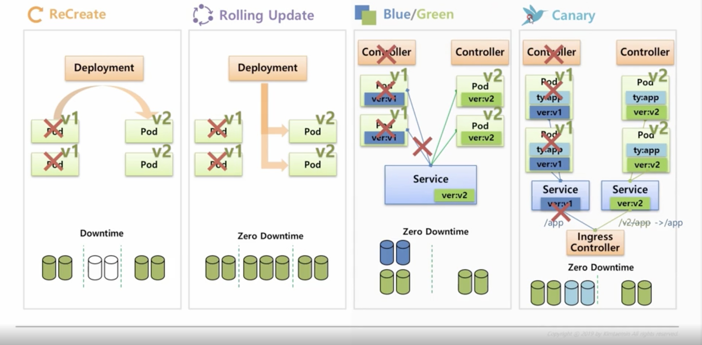

### deployment

~~~
1. ReCreate
- v1의 pod를 삭제 한 뒤 v2의 pod를 생성
- downtime이 발생하기에 일시적으로 정지가 가능한 서비스에서 사용가능한 방식 
- revisionLimit replicaSet 의 최대 개수를 지정 (지정 하지않을시 계속해서 replica가 0인 replicaSet이 계속 남음)

2. Rolling Update
- v2 pod를 먼저 생성 v1, v2 모두 서비스중
- v1의 pod를 하나 삭제 후 v2 pod하나 생성
- 배포중 추가 적인 자원을 사용 하게 되지만 downtime은 발생하지 않음

3. Blue/Green
- deployment를 이용해서 할 수 있지만 다른 controller를 이용해서 사용이 가능
- service와 pod의 label로 연결 되어있는 상태에서 ver2의 pod를 생성 (총 자원 사용량 * 2)
- service의 label을 v2의 label로 변경 하게 되면 v2 pod만 서비스에 연결된다
- v2 pod 에서 문제가 발생시 service의 label만 다시 v1 으로 변경 하면 되기에 rollback이 쉽다
- downtime은 발생 하지 않는다

4. Canary
- 첫번째 방식 v1 pod 와 v2 pod 를 같은 label값을 설정해 같은 service에 연결 v1 v2 모두 연결 가능 v2문제 발생시 v2 controller 제거 (불특정 다수에 의한 테스트를 위한 방법)
- 두번째 방식 2개의 서비스를 만들고 v1 v2를 각 서비스에 연결 ingress controller를 이용해 path에 따른 버전 확인 가능
~~~

# Reference
----
**Deployments** : https://kubernetes.io/docs/concepts/workloads/controllers/deployment/