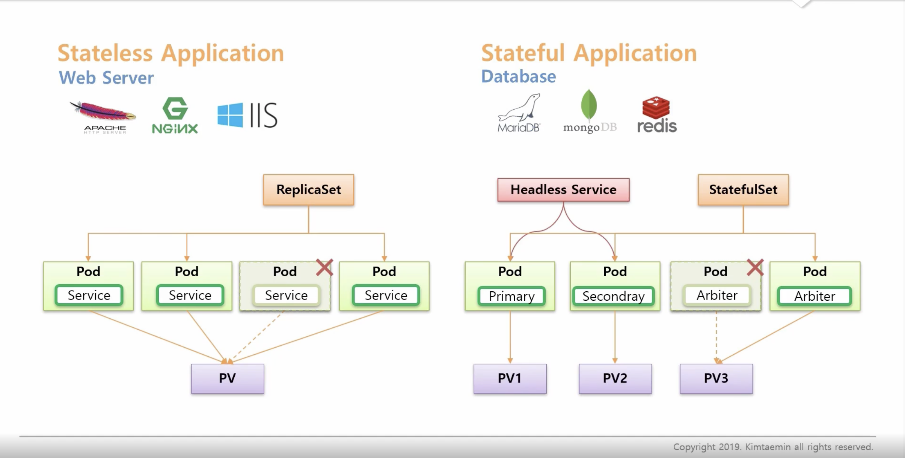
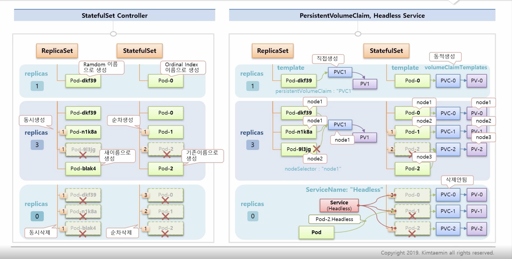
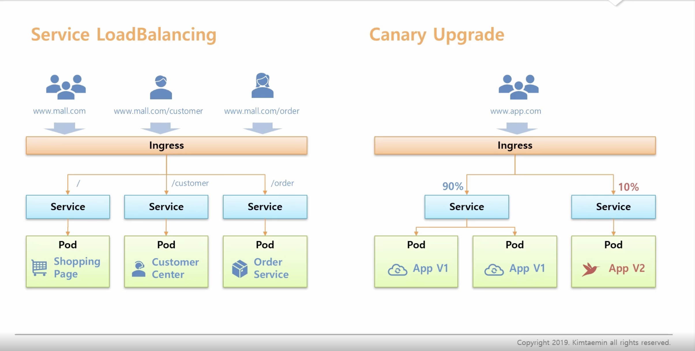
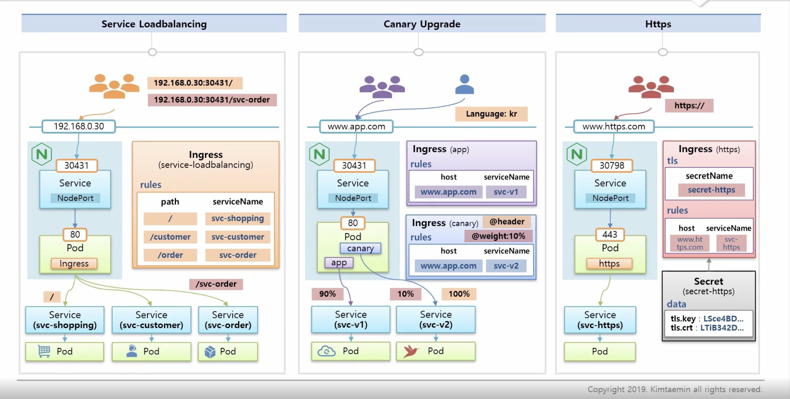
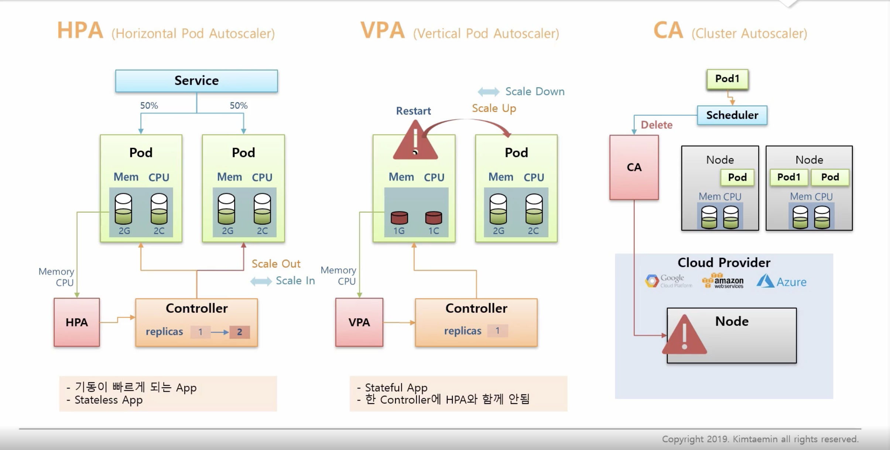

# Controller

### StatefulSet


```
1. Stateless Application 
  - webServer
  - app이 여러개 배포 되더라도 같은 역할을 함
  - traffic 분산
  - volume의 값은 필수 x
  - ReplicaSet

2. Stateful Application 
  - Database
  - 각 app마다 자신의 역할이 존재함
  - volume의 값은 필수
  - 목적에 따른 network 통신
  - StatefulSet
```


```
- replicas: 1로 생성을 하면 statefulSet은 이름+index로 생성을 하게 되며 replicas를 증가 시키면 순차적으로 생성이 되며
  replicas를 감소 시키면 마지막 index를 기준으로 순차적으로 삭제가 진행됨
- pvc, pv 가 pod별로 생성, replicas를 0으로 설정하면 생성된 pvc, pv는 삭제가 되지않음, 사용자가 수동으로 삭제 해야함
- serviceName 속성으로 headless 서비스와 매칭이 가능 -> domain이 생성 됨 
```

### Ingress
---

```
- path 값을 지정해 해당하는 service로 요청이 가능하도록 수정이 가능
- canary Upgrade: 새로운 버전의 service에 path를 지정 한 뒤 해당 하는 service에 traffic이 10%로 요청이 되도록 수정이 가능
```


```
1. service loadbalancing
  - ingress를 통해 해당 path로 요청이 온 경우 원하는 service를 지정할 수 있다

2. canary upgrade
  - weight: 10% (해당 ingress에 설정된 service는 traffic의 10%만 요청)
  - header: 특정 path에 대해서 설정 가능 (나라별 웹 사이트 지정)

3. https
  - ingress 설정시 tls 값 설정 secret 안에는 인증서의 값을 가지고 있음
```
----
### Auto scaler



```
1. HPA
  - pod에 traffic이 증가해 자원을 모두 할당 하게 될 때 HPA 설정이 되어있으면 pod를 생성해준다.
  - scale out: replicas 증가 pod 생성
  - scale in: replicas 감소 pod 제거
  - stateless App (기동이 빠르게 되는 App)

2. VPA
  - stateful
  - pod 재시작을 통해 자원 증가 및 감소
  - scale up: 자원증가
  - scale down: 자원 감소
  - 한 controller에 HPA와 함께 사용하면 안됨

3. CA
  - localNode에 자원이 부족하면 scheduler가 CA를 통해 cloud provider에 요청
  - 자원 여부에 따라서 cloud provider Node 생성 및 삭제
```

# Reference
----
**StatefulSets** : https://kubernetes.io/docs/concepts/workloads/controllers/statefulset
**StatefulSet Basics** : https://kubernetes.io/docs/tutorials/stateful-application/basic-stateful-set

**Ingress** : https://kubernetes.io/docs/concepts/services-networking/ingress/
**Ingress Controllers** : https://kubernetes.io/docs/concepts/services-networking/ingress-controllers/

**Horizontal Pod Autoscaler** : https://kubernetes.io/docs/tasks/run-application/horizontal-pod-autoscale/
**Horizontal Pod Autoscaler Walkthrough** : https://kubernetes.io/docs/tasks/run-application/horizontal-pod-autoscale-walkthrough/
