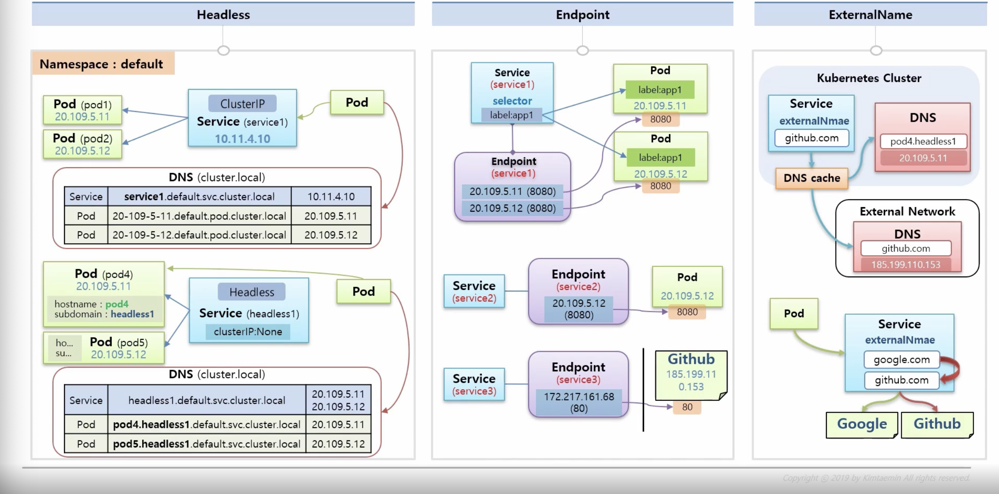
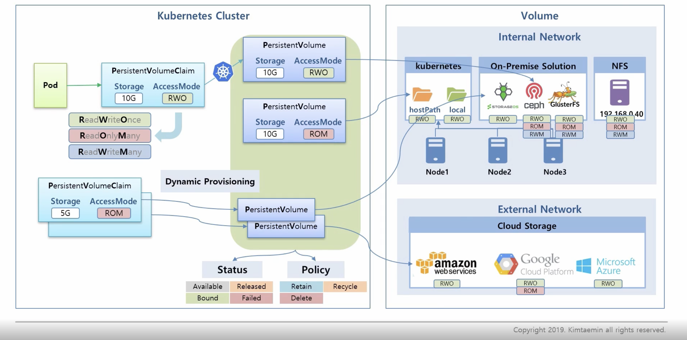
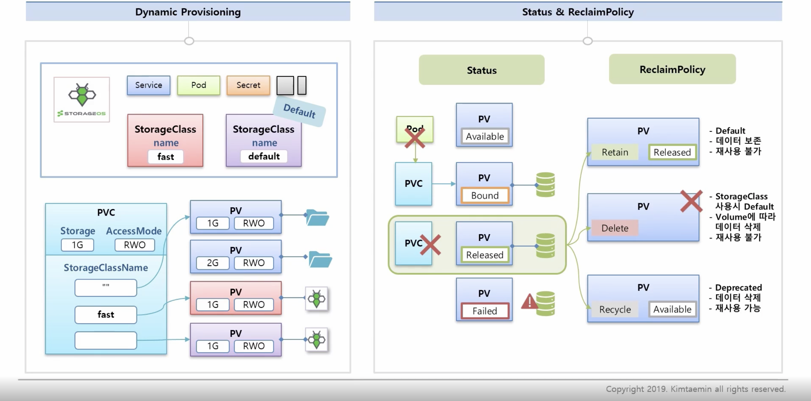
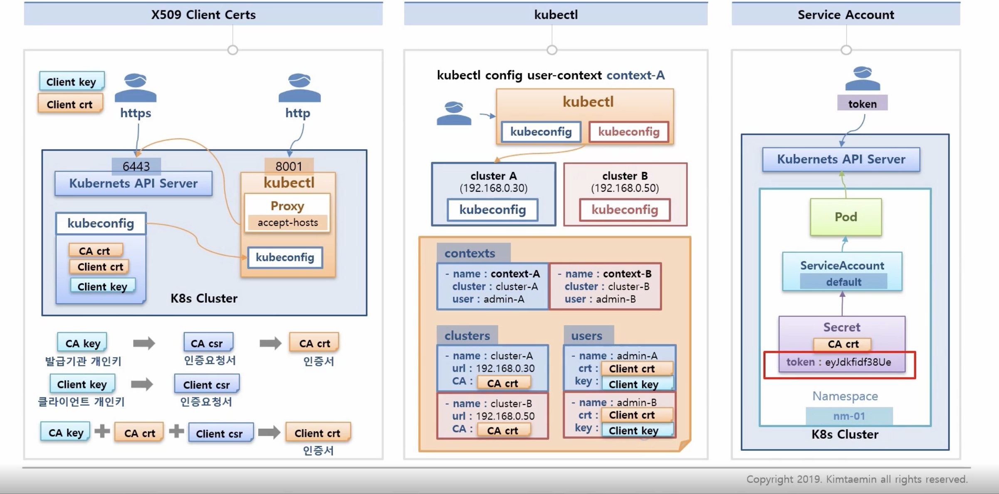

# Object

---

### Service



```
* Service DNS 규칙: {serviceName}.{nameSpace}.svc.{Dns name}
* Pod DNS 규칙: {ip}.{nameSpace}.pod.{Dns name}
* 같은 namespace 안에서는 service는 앞자리만 입력 해도 되지만 pod는 모든 주소를 입력 해야함

1. Headless
  - Service로만 통신 하는 것이면 clusterIp로 해결이 가능 하지만 특정 pod를 통신해야 하는 경우 Headless를 사용
  1. Service 생성시 clusterIp: None 추가해서 Service에 Ip가 생성되지 않도록 함
  2. pod 생성시 hostname, subdomain 설정
  3. Service는 연결된 pod의 ip를 모두 할당 받으며 hostname.subdomain으로 해당 pod에 요청이 가능하게 됨

2. Endpoint
  - Service와 Pod 연결시 selector와 label 값을 설정해서 하는데 실제 생성시 내부적으로는 endpoint를 생성함
  - endpoint 직접 연결
    1. service 생성시 selector지정 x
    2. pod 생성시 label 지정 x
    3. service명으로 endpoint 생성후 접속정보 연결

3. ExternalName
  - externalName에 domain 등록시 Dns Cache가 외부와 내부 Dns를 찾아 ip를 알아내게됨
  - 접속하기 위한 외부 주소가 바뀌더라도, CNAME은 그대로 유지할 수 있어 애플리케이션을 다시 작성하거나 빌드하지 않아도 된다.
```

-----

### Volume


```
- 데이터를 안정적으로 유지하기 위해서 쓰임
- internal
    1. 내부 경로로 지정 가능
    2. op-premise solution을 node에 설치 해서 사용 가능
    3. nfs를 이용해서 다른 서버를 이용 가능
- external
    외부 cloud storage 를 이용해서 사용
- pvc accessMode는 kubernetes는 3가지를 지원해주지만 모든 volume이 지원하는게 아니기 때문에 확인이 필요
```


```
1. Dynamic Provisioning
  - pvc 생성시 pv를 자동으로 생성
  - pvc 생성시 storageClassName 지정

2. Status
  - Available
      * 최초 pv가 만들어 졌을 때
  - Bound 
      * pvc와 연결이 된 상태
  - Released 
      * pvc 삭제 시 pv 연결이 끊어진 상태 
  - Failed
      * pv와 실제 데이터간 연동에 문제가 생긴 경우

3. ReclaimPolicy
  - Released 상태가 되었을때 동작을 정의

  - Retain 
      * default
      * 데이터 보존
      * 재사용 불가
  - Delete 
      * StorageClass 사용시 Default
      * volume의 종류에 따라 데이터 삭제
      * 재사용 불가
  - Recycle
      * Deprecated
      * 데이터 삭제
      * 재사용 가능
```

##### StorageClass

```yaml
apiVersion: storage.k8s.io/v1
kind: StorageClass
metadata:
  name: default
  annotations:
    # Default StorageClass로 선택 
    storageclass.kubernetes.io/is-default-class: "true" 
# 동적으로 PV생성시 PersistentVolumeReclaimPolicy 선택 (Default:Delete)
reclaimPolicy: Retain, Delete, Recycle
provisioner: kubernetes.io/storageos
# provisioner 종류에 따라 parameters의 하위 내용 다름 
parameters:   
```

----
### Authentication


```
1. X509 Client Certs
  - Cluster의 kubeConfig정보를 가져와서 인증 요청이 가능
  - CA key: 발급기관 개인키
  - Client Key: 클라이언트 개인키
  - kubectl 설치시 kubeconfig 내용을 등록하는 과정을 거쳐 kubectl을 이용 api요청이 가능한 상태가 됨
  - accept-hosts를 이용해 8001 포트로 proxy 열어두면 외부에서도 http로 접근이 가능

2. 외부 서버 kubectl
  - 여러 kubeconfig를 등록 가능 -> 여러 cluster에 접근이 가능

3. service Account
  - NameSpace 생성시 default라는 이름의 serviceAccount가 자동으로 생성
  - Secret정보가 담겨있음 (token, CA crt)
  - token값을 알고 있다면 사용자도 api 서비스 접근이 가능
```

# Reference
----
**DNS for Services and Pods** : https://kubernetes.io/docs/concepts/services-networking/dns-pod-service/
**Customizing DNS Service** : https://kubernetes.io/docs/tasks/administer-cluster/dns-custom-nameservers/

**StorageClass** : https://kubernetes.io/docs/concepts/storage/storage-classes
**Dynamic Volume Provisioning** : https://kubernetes.io/docs/concepts/storage/dynamic-provisioning


