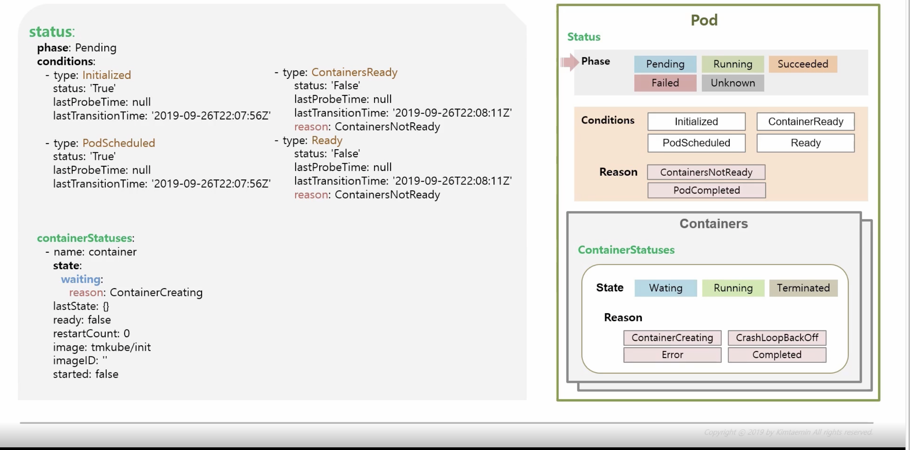
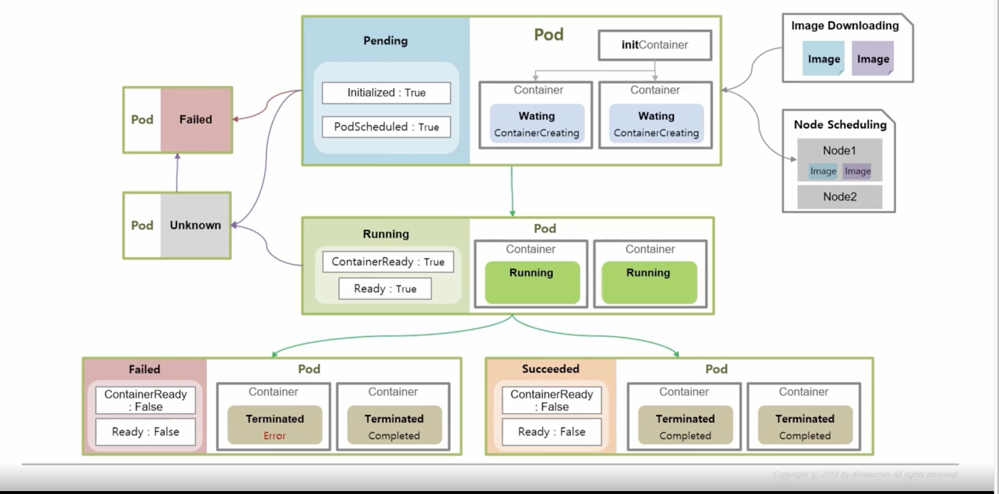
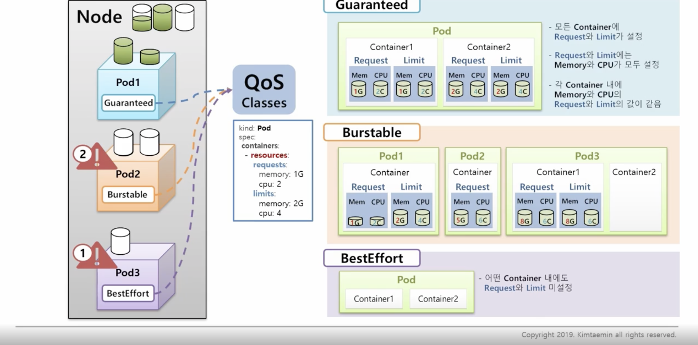

# pod

----
### lifecycle

~~~
1. status
  - Phase: pod의 상태를 알려줌 (pending, running, succeeded, failed, unknown)
  - Conditions: 상세 내용 (initialized, containersReady, PodScheduled, Ready)
      Reason: Conditions 더 세부적인 내용 (ContainersNotReady, PodCompleted) status가 false인 경우 나타남

2. ContainerStatuses
  - State: container의 상태를 나타냄 (Wating, Running, Terminated)
  - Reason: 상태에 따른 상세 내용 (ContainerCreating, CrashLoopBackOff, Error, Completed)
~~~

1. pending
  - pod의 최초 상태
  - initContainer: 본 container가 실행되기전 초기화 시켜야 하는 내용이 있는경우 그 내용을 담는 container 설정
    * 성공하거나 설정하지않은경우 initialized: True로 변경
  - podScheduled: node에 정상 할당이 된 경우 true, initialized 보다 먼저 동작
  - imageDownloading: image 다운 받는 상태
2. running
  - pending상태 후 container가 실행되고 있는 상태
  - container가 기동시 재시작 되는 상태가 된다면 container의 상태는 wating reason은 crashLoopBackOff
  - 기동시 ContainerReady: true, Ready: true 상태여야 함
  - pod상태는 running이지만 container상태는 wating일 가능성이 있기에 같이 확인 해야함
3. succeeded
  - job이 실행된 후 성공적으로 수행되었다면 succeeded상태
  - ContainerReady: false, Ready: false 상태
4. failed
  - job이 실행된 후 container에 에러가 발생 하면 failed 상태
  - 또한 pending시 에러가 발생한 경우에도 failed 상태
  - ContainerReady: false, Ready: false 상태
5. unknown
  - pending 이나 running중 통신장애가 발생하면 unknown 상태
  - 이 상황이 지속 되면 failed로 변경

----
### ReadinessProbe, LivenessProbe

~~~
1. ReadinessProbe
  scenario 
    * 1. node 2개가 한개의 서비스로 기동이 되고 있는경우 각 node가 traffic을 반반씩 가져간다고 가정
    * 2. node 하나가 down이 된 경우 autoHealing기능에 의해서 새로운 node의 pod가 생성 되게 됨
    * 3. pod 생성시 최초 pending 상태로 서비스가 아직 정상 기동이 되지 않은 상태에서 요청을 받게 됨
    * 4. 사용자는 50% 확률로 에러를 유발 하게 됨
  - 이러한 문제점을 해결하기 위해 app 구동 순간에 traffic 요청을 받지 않을 수 있게 함

2. LivenessProbe
  scenario
    * 1. pod는 정상 기동 하지만 app 자체가 문제가 발생 할 수 있음 (memory overflow 등 500 에러)
  - 이때 app에 대해 문제점을 해결 할 수 있음
  - app에 대한 장애여부를 판단하고 restart하므로서 잠시 장애는 발생 할 수 있지만 지속적인 장애는 해결 할 수 있음

options 
  # 요청방식 공통
    - httpGet
    - Exec
    - tcpSocket
  # 옵션 값
    - initialDelaySeconds: 최초 요청 하기전 delay값 (default: 0초)
    - periodSeconds: probe를 체크하는 시간의 간격 (default: 10초)
    - timeoutSeconds: 지정한 시간까지 결과가 와야함 (default: 1초)
    - successThreshold: 몇번을 성공해야 성공이라 판단 하는가 (default: 1회)
    - failureThreshold: 몇번을 실패해야 실패라 판단 하는가 (default: 3회)
~~~
----
### Qos (Guaranteed, Burstable, BestEffort)

~~~
1. ReadinessProbe
  scenario
      * 1. node에 리소스가 있다고 가정하고, node위에 pod가 3개 만들어져서 균등하게 자원을 사용하고 있는 상태이다.
      * 2. 특정 pod에서 리소스를 더 필요로 하는 경우에는 다른 pod들를 죽이고 리소스를 더해야할지, 아니면 파드는 리소스를 더 늘리지 못한 상태로 죽어야할지에 대한 선택이 필요
  mechanism
      우선 순위 Guaranteed < Burstable < BestEffort
      * Guaranteed
        - 모든 Container에 Request와 Limit가 설정되어있고, Request와 Limit에는 Memory와 CPU가 모두 설정되어있다. 
        - 각 Container내에 Memory와 CPU의 Request와 Limit값이 같아야한다.

      * Burstable
        - container의 Request와 Limit의 자원값이 일치하지 않는경우
        - container의 Request 혹은 Limit 값중 하나만 설정이 되어있는 경우
        - pod한개내의 다수의 container가 있을경우, Request와 Limit가 설정되지 않는 container가 있는경우
        - 우선순위가 밀려 삭제되는경우에는 메모리가 Request에 비해 사용중인 App으로 OOM score(Out of Memory)를 계산하여
          사용량이 높은 Pod가 먼저 삭제된다.
      
      * BestEffort
       - pod의 어떤 container내에도 Request와 Limit가 미설정 되어있는 경우이다.
~~~

---

### Node Scheduling

~~~
1. Node 선택
  - NodeName
      * NodeName을 명시 해당 Node로 Pod가 생성
      * 실제 환경에서는 NodeName이 가변적일 수 있어 잘 활용하지 않음
  - NodeSelector
      * Node의 Label값을 찾아 할당
      * 여러개의 Node가 같은 Label 값을 사용할 수 있어 scheduling에 따라서 다시 할당 될 수 있음
      * Matching이 되는 Label 이 없으면 pod는 어떤 Node에도 할당이 되지 않아 에러가 발생
  - NodeAffinity
      * Label의 key만 설정해도 scheduling을 통해서 자원이 많은 Node에 할당
      * 조건에 맞지않는 Key를 가지고 있어도 자원이 많은 다른 node에 할당이 되도록 설정이 가능

2. Pod 집중/분산
  - Pod Affinity
      * 서로 다른 Pod를 같은 Node에 할당이 되도록 설정이 가능
  - Anti-Affinity
      * 서로 다른 Pod를 서로 다른 Node에 할당이 되도록 설정이 가능

3. Node에 할당제한
  - Toleration
      * Node에 Taint설정 해주면 Pod는 Toleration를 가지고 있어야 할당이 가능해짐
  - Taint
      * Node에 값을 설정 해주면 Pod는 Toleration를 가지고 있어야 할당이 가능해짐
~~~

##### Node Affinity

##### Node Affinity, Pod Affinity, Taint, Toleration

~~~
1. Node Affinity
  - matchExpressions: replicaSet의 설정과 동일하게 사용이 가능
      Exists = 해당 되는 key가 포함되어 있는가
      DoesNotExist = 해당 되는 key가 포함되어 있지 않은가
      In = key와 value를 지정 포함 되어있는지 확인
      NotIn = In과 반대 개념
      Gt = 지정한 values보다 큰 값
      Lt = 지정한 values보다 작은 값
  - required: 설정에 matching이 되는 값이 없다면 pod는 할당을 받지 못해 생성이 되지않음
  - preferred: matching이 되는 값이 없어서 해당 값은 선호될 뿐 다른 적절한 Node에 할당
      weight: Node를 지정할 떄 가중치를 주어 해당 Node를 더 선호 할 수 있도록 설정이 가능

2. Pod Affinity, Pod AntiAffinity
  - matchExpressions: pod의 해당되는 label를 지정
  - topologyKey: Node의 있는 key를 찾음, 지정한 값의 key를 가진 Node만 찾는 설정
  - required: 설정에 matching이 되는 값이 없다면 pod는 할당을 받지 못해 생성이 되지않음
  - preferred: matching이 되는 값이 없어서 해당 값은 선호될 뿐 다른 적절한 Node에 할당
      weight: Node를 지정할 떄 가중치를 주어 해당 Node를 더 선호 할 수 있도록 설정이 가능

3. Taint
  - effect:
      NoSchedule: 할당 불가
      PreferNoSchedule: 필수 설정이 아님
      NoExecute: 할당 불가
        tolerationSeconds: 해당 시간이 지나면 pod는 삭제
  - NoSchedule vs NoExecute:
      NoSchedule의 경우 node에 이미 pod가 할당이 되어있는 경우 Taint값을 설정 해두었을때 기존의 있는 pod는 삭제 되지않는다
      NoExecute의 경우 이미 할당이 되어있는 pod는 삭제 된다

4. Toleration
  - label의 값과 effect의 종류까지 모두 matching이 되어야지 할당이 가능
  - pod의 nodeSelector는 별도로 지정 해야 할당이 가능해짐
  - key: Taint Node의 label key
  - operator:
      Equal: 완전일치
      Exists: 부분일치
  - value: Taint Node의 label value
  - effect: Taint Node의 effect value
~~~

# Reference
----
**Pod Lifecycle** : https://kubernetes.io/docs/concepts/workloads/pods/pod-lifecycle/
**Assigning Pods to Nodes** : https://kubernetes.io/docs/concepts/configuration/assign-pod-node
**Taints and Tolerations** : https://kubernetes.io/docs/concepts/configuration/taint-and-toleration