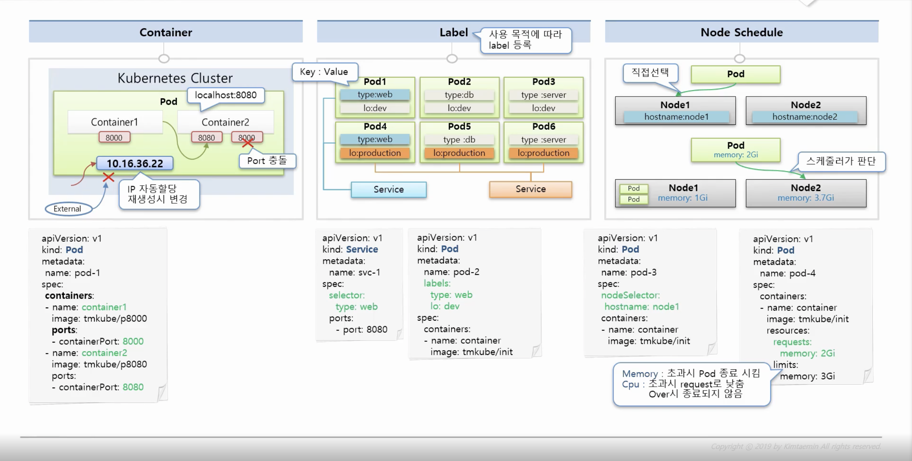

### pod

~~~
1. container
- 같은 pod container port는 중복x
- pod 생성시 고유 ip 할당, kubernetes cluster내 에서만 접근 가능 외부에서 해당 ip 접근 불가
- pod 문제 발생시 재기동 -> ip는 새로 할당 (휘발성)

2. label
- key: value 로 설정
- 원하는 pod 의 key와 value를 통해 같은 서비스로 묶을수 있음

3. node
- pod 생성시 node 지정 가능 nodeSelector: key: value
- scheduler 판단 가능, memory 지정가능
- CPU가 limits 수치까지 올라갔다고 해서 무조건 Request 수치까지 core를 낮추는 것이 아니고, Node의 전체 부하 상태가 OverCommit된 상태일때 동작합니다. 
Node 위의 Pod들이 Node의 자원을 모두 사용하고도 그 이상을 자원을 요구하게 되었을 때 Limit 수치까지 CPU를 사용하고 있는 Pod들에 한해서 
그 수치를 Reqeust까지 떨어뜨리게 되며 Memory의 경우에도 그러한 상태일때 Limit까지 올라간 Pod들에 한해 재기동 시키게 됩니다.
~~~


##### kubectl

1. Create

```yaml

# 파일이 있을 경우
kubectl create -f ./pod.yaml

# 내용과 함께 바로 작성
kubectl create -f - <<END

apiVersion: v1
kind: Pod
metadata:
  name: pod1
spec:
  containers:
  - name: container
    image: kubetm/init
END

```

2. Apply

```yaml
kubectl apply -f ./pod.yaml
```

3. Get

```yaml
# 기본 Pod 리스트 조회 (Namepsace 포함)
kubectl get pods -n defalut

# 좀더 많은 내용 출력
kubectl get pods -o wide

# Pod 이름 지정
kubectl get pod pod1

# Json 형태로 출력
kubectl get pod pod1 -o json
```

3. Describe

```yaml
# 상세 출력
kubectl describe pod pod1
```

4. Delete

```yaml
# 파일이 있을 경우 생성한 방법 그대로 삭제
kubectl delete -f ./pod.yaml

# 내용과 함께 바로 작성한 경우 생성한 방법 그대로 삭제
kubectl delete -f - <<END
apiVersion: v1
kind: Pod
metadata:
  name: pod1
spec:
  containers:
  - name: container
    image: kubetm/init
END

# Pod 이름 지정
kubectl delete pod pod1
```

5. Exec

```yaml
# Pod이름이 pod1인 Container로 들어가기 (나올땐 exit)
kubectl exec pod1 -it /bin/bash

# Container가 두개 이상 있을때 Container이름이 con1인 Container로 들어가기 
kubectl exec pod1 -c con1 -it /bin/bash
```

~~~
Apply vs Create
둘다 자원을 생성할때 사용할 수 있지만, [Create]는 기존에 같은 이름의 Pod가 존재하면 생성이 안되고, [Apply]는 기존에 같은 이름의 Pod가 존재하면 업데이트됨
~~~

# Reference
----
**Pod Overview** : https://kubernetes.io/docs/concepts/workloads/pods/pod-overview/
**Labels and Selectors** : https://kubernetes.io/docs/concepts/overview/working-with-objects/labels/
**Assigning Pods to Nodes** : https://kubernetes.io/docs/concepts/configuration/assign-pod-node/