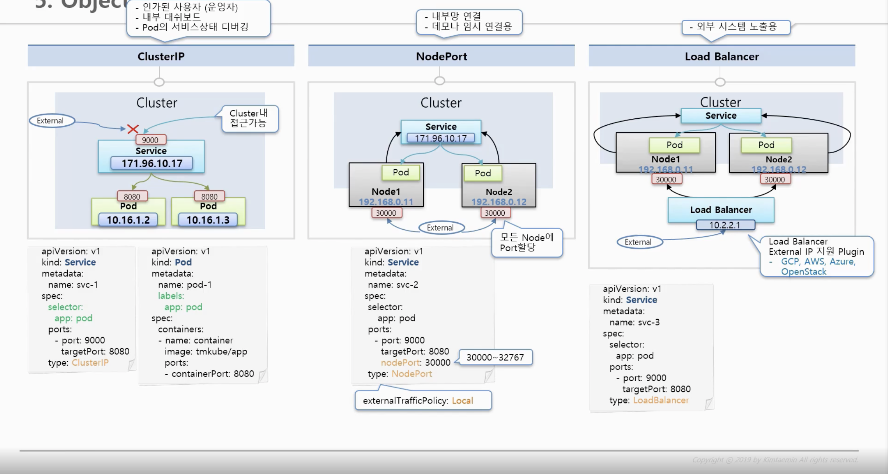

### service


~~~
1. ClusterIP
- pod의 ip는 가변적 이므로  불변적 service ip를 이용
- cluster내 접근가능, 여러개 pod 연결 가능
- default type

2. NodePort
- ClusterIP 할당, 같은 기능이 포함 되어있음
- 연결된 node는 모두 같은 port로 할당, ip의 port로 연결을 하면 service 연결
- 모든 node에 port 할당
- port 범위 - 30000~32767 설정 하지 않을 시 자동으로 port 할당
- traffic 모든 node의 pod로 전달
- externalTrafficPolicy: Local 설정시 모든 node traffic 전달 하지 않음

3. Load Balancer
- NodePort 의 특징을 그대로 가지고 있음
- Load Balancer ip는 별도의 plugin으로 할당 해야함
~~~

##### kubectl

1. GET
  - defalut 이름의 Namespace에서 svc-3 이름의 Service 조회

  ```
  kubectl get service svc-3 -n defalut
  ```

### Reference
----
**Service** : https://kubernetes.io/docs/concepts/services-networking/service/
**Kubernetes NodePort vs LoadBalancer vs Ingress?** : https://medium.com/google-cloud/kubernetes-nodeport-vs-loadbalancer-vs-ingress-when-should-i-use-what-922f010849e0
