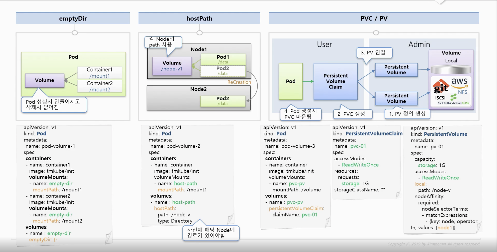

### volume



~~~
1. emptyDir
- container 끼리 데이터를 공유 하기 위함
- pod 문제가 생기면 없어질 수 있음 (일시적인 데이터만 관리하는걸 권장)

2. hostPath
- node의 올라가 있는 path를 기준으로 사용
- pod가 문제가 생겨도 데이터는 없어짐
- schedule의 의해서 다른 node에 pod가 생성 될 수 있음 -> path가 없는 node에 pod가 생성 될 가능성이 있다
  solution -> node 추가시 마다 mount를 걸어줄 수 있다. (이런 구성으로 작업하는 건 추천 하지 않는다)
- pod 자신이 할당 되어있는 host의 데이터를 읽거나 사용 할 때 쓰일 수 있다

** host path type
DirectoryOrCreate : 실제 경로가 없다면 생성
Directory : 실제 경로가 있어야됨
FileOrCreate : 실제 경로에 파일이 없다면 생성
File : 실제 파일이 었어야함

3. PVC / PV
- pod 영속성 있는 volume을 제공하기 위함
- 외부 원격을 이용해서 연결 할 수 있다. ex) amazon, nfs
- pv - volume을 연결하기 위한 spec 정의
- pcv - 실제 사용 하기 위한 spec 정의
  storageClassName: "" -> 다른 동작으로 사용 될 수 있기 때문에 빈 값을 정의해줌
~~~

##### kubectl

```yaml
# 해당 배포 버전으로 rollback
kubectl rollout undo deployment deployment-1 --to-revision=2
# 배포 버전 정보 확인
kubectl rollout history deployment deployment-1
```

# Reference
----
**Volumes** : https://kubernetes.io/docs/concepts/storage/volumes/